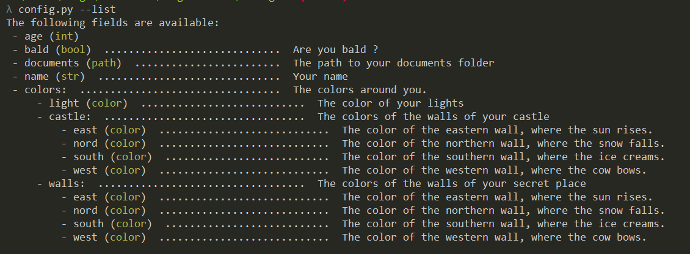

# configlib

A bit desesperate by the lack of good and easy to use configuration libraries in python, 
I decided to write this one. The two main goals are:
- Make it easy for the you to describe the data you use to configurate your project and be able 
to save and load it in one line
- Make it easy for the user of your code to modify his configuration through the command line

### Installation

    pip install pyconfiglib

## User interface

The end user can easily see his configuration with

    python config.py --show

That will print in colors (if availaible) his config:

He is able to see what are all the fields easily with

    python config.py --list
    

He can change each field in an interactive prompt, for the whole configuration 
or only a sub configuration by one of the following. 
He can also directly set one field via the command line:

    python config.py
    python config.py colors.castle
    python config.py age=42
    python config.py colors.walls.east=#ffaa77

## Developper interface

### Simple configuration

#### Fields

To create a configuration for you project, just create a new subclass of `Config`.
All the class attributes defined here are called _fields_. 
A field is a name associated with a data. The fields are what will be saved/stored in you configuration file.

Example:

    import configlib
    
    class Config(configlib.Config):
    
        name = 'John'
        surname = 'Jo'
        age = 42

**NOTE:** fields names can not start nor end with an underscore (`_`), 
so we can have attributes not tracked by the config.

**NOTE:** no field can be set to a callable object. 
This is a deliberate choice to allow defining functions in the class' body.

#### Types

The fields are typed so you don't have to verify that a configuration is valid when you load it.
If the data of a field is `int`, `float`, `str` or `bool`, you do not have to precise the type of the field.

You can precise a type by adding a `__[FIELD-NAME]_type__ = ...` class attribute.

If you want an other type, there are two options:
- You want an other builtin type, like `list`, `dict` or `tuple`, then you need to precise the type you want:
     
        class Config(configlib.Config):
            ...
        
            pet_names = ['didi', 'bibi', 'lili']
            __pet_names_type__ = configlib.Python(dict)

   However:
    - you don't have to, but this adds the possibility for the user to enter the value he wants when prompted.
    - The value is evaluated with python's `eval` function, so the user can run any code. 
    This is potentially dangerous, even if you trust your users.
    - If you want a `dict` and know the `dict`'s keys, it is better to use a `SubConfig` instead.

 - You want a custom type or just restrict some values. If so you need to create a new `ConfigType` subclass. 
 
##### Custom Types

_In the following, `MyType` designate your custom type, `StoredType` and is that you stores in the json which is one of 
 `bool`, `int`, `float`, `list`, `dict` or  `str` (those are the only types json supports). Usually it will be `str` (`or list`)_

Say that you want only positives intergers for the age. You can create a `PositiveIntegerType`.   

A subclass of `ConfigType` must define 4 things:
 - a `name`. This the name of the type, who is supposed to be more gentle than the class name, it will be 
    shown to the user.
 - a `load(value: Union[StoredType, str]) -> MyType` method. This method will be called when loading the configuration, 
    from the json file and on user input. This must raise a `ValueError` when you can't load the value.
 - and a `save(value: MyType) -> StoredType` method. This is used to convert from your type to something json can handle
    when the configuration is saved.
 - an `is_valid(value: MyType) -> bool` method. This is used every times the field is set, and should return True is 
    the given value is a valid data for the field. Usually, it can just be `return isinstance(value, MyType)`
    

###### Example
    
    class PositiveIntegerType(configlib.ConfigType):
        
        name = natural number
        
        def load(value):
            if isianstance(value, str):
                value = int(value)
                
            if not isinstance(value, int):
                raise ValueError('Not an integer')
                
            if value > 0:
                return value
            else:
                raise ValueError('Not positive')
                
        def save(value):
            return value
            
        def isvalid(value):
            return isinstance(value, int) and value > 0
    
And then in your `Config` class add:

    class Config(configlib.Config):
        ...
        
        __age_type__ = PositiveIntegerType()

**NOTE:** Don't forget to instantiate `ConfigType`.

#### Hints

You can also add hints, that will be displayed when the user is prompted for a field or when the list is displayed.
Hints are specified in the same way as the types, by adding a `__[FIELD-NAME]_hint__` class attribute.

Example:

    class Config(configlib.Config):
        ...

        __age_hint__ = 'Your age in days'

#### Printing

You can pretty print the configuration with `__show__`. 
This will print the config and to add colors is pygments is installed.

Alternatively, you can just `str()` the config to get a human readable string, 
without any color. `repr()` returns the same string but in only one line.

### Sub-Configurations
*Documentation needs to be done*

### Other important stuff

#### Save emplacement

To define where a configuration is saved, set the value of `__config_path__` to the path you want. 
It is better to to specify absolute path relative to the current `__file__` like this one:

    __config_path__ = os.path.join(os.path.dirname(__file__), '.config')

Because the current directory may not be the one of your code, because a script can be called from everywhere.

#### Allow user interface

At the end of your config's file, you can add: 

    if __name__ == '__main__':
        configlib.update_config(Config)

So running `python config.py [OPTIONS]` will trigger the command line interface described in the first part.
